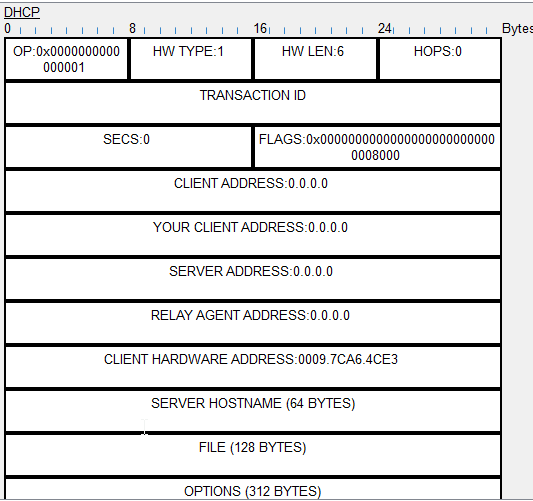
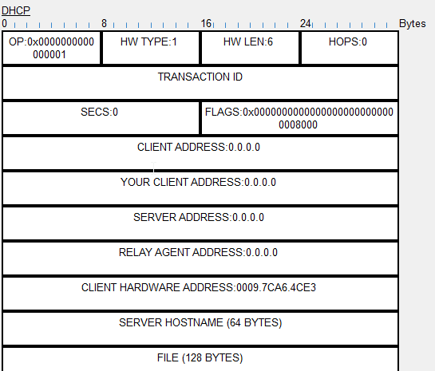
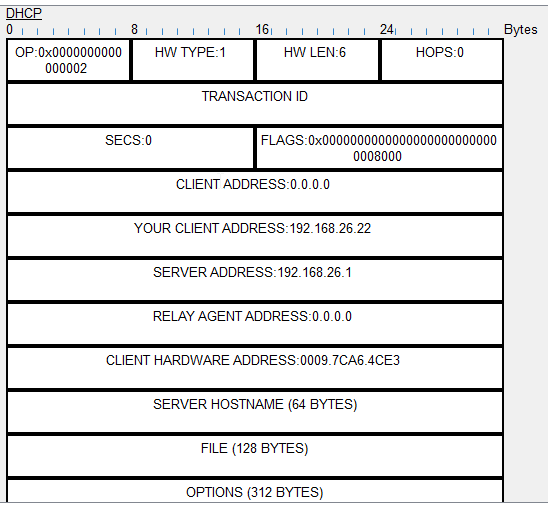
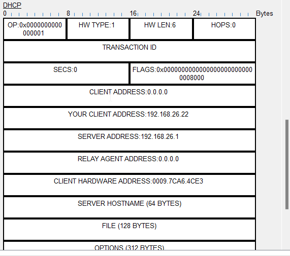
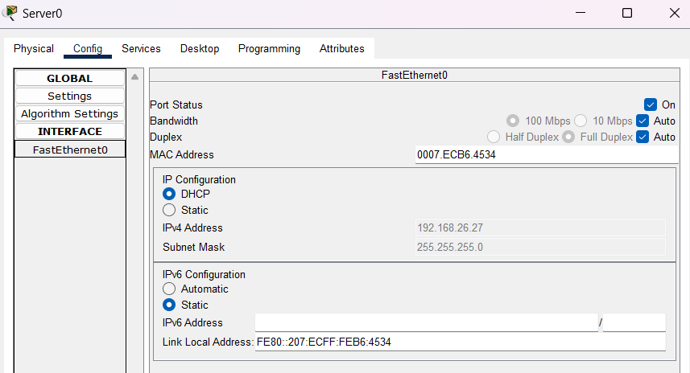
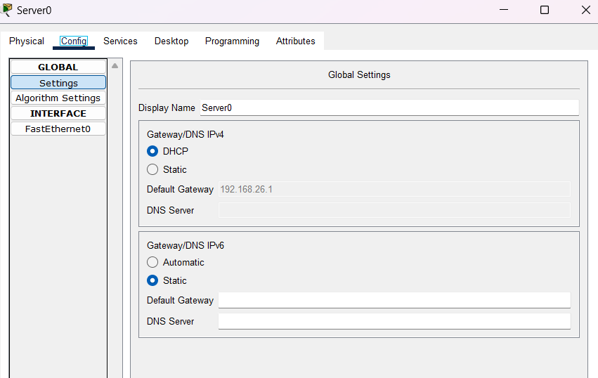
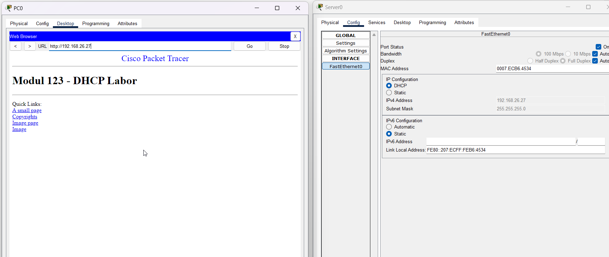

Welcher manueller Konfigurationsprozess entfällt durch den Einsatz von DHCP?
Das konfigurieren von IP Subnetzmaske Default gateway und DNS Server.
An welche IP-Adresse sendet der DHCP-Client den DHCPDISCOVER? Wie lautet die Bezeichnung für die Art dieses IP-Packetes?
And die IP 255.255.255.255 und das paket lautet Broadcastpaket

Stellen Sie den DHCP-Anforderungsprozess zwischen dem DHCP-Client und dem DHCP-Server grafisch dar.

Wie kann es trotz Einsatz eines DHCP-Servers zu einem IP-Konflikt kommen?
Statische IP-Adressen: Ein Konflikt kann auftreten, wenn ein Gerät eine statische IP-Adresse hat, die bereits Teil eines aktiven DHCP-Bereichs ist2. Dies kann auch passieren, wenn die DHCP-Leasetabelle verloren geht und ein Endgerät die IP noch von einem alten Lease hat3.

Mehrere DHCP-Server: Wenn Sie mehr als einen DHCP-Server mit überlappenden Adressbereichen haben, kann dies zu Konflikten führen.

1. Router-Konfiguration auslesen

Für welches Subnetz ist der DHCP Server aktiv?
192.168.26.1 /24 
Welche IP-Adressen ist vergeben und an welche MAC-Adressen? (Antwort als Tabelle)
IP address       Client-ID/              Lease expiration        Type
                 Hardware address
192.168.26.23    0001.632C.3508           --                     Automatic
192.168.26.26    0007.ECB6.4534           --                     Automatic
192.168.26.24    0050.0F4E.1D82           --                     Automatic
192.168.26.25    00E0.8F4E.65AA           --                     Automatic
192.168.26.22    0009.7CA6.4CE3           --                     Automatic
192.168.26.27    00D0.BC52.B29B           --                     Automatic

In welchem Range vergibt der DHCP-Server IPv4 Adressen?
192.168.26.1     - 192.168.26.254
Was hat die Konfiguration ip dhcp excluded-address zur Folge?
Er vergiebt die ip addressen die excluded sind nicht
Wie viele IPv4-Adressen kann der DHCP-Server dynamisch vergeben?
254 IP addressen kann er ingesammt vergeben.

2. DORA - DHCP Lease beobachten

Welcher OP-Code hat der DHCP-Offer?
OP:0x0000000000000002
Welcher OP-Code hat der DHCP-Request?
OP:0x0000000000000001
Welcher OP-Code hat der DHCP-Acknowledge?
OP:0x0000000000000002
An welche IP-Adresse wird der DHCP-Discover geschickt? Was ist an dieser IP-Adresse speziell?
An die IP 255.255.255.255 die ist speziell, da sie an alle Geräte versendet wird.

An welche MAC-Adresse wird der DHCP-Discover geschickt? Was ist an dieser MAC-Adresse speziell?
An FF:FF:FF:FF:FF:FF sie ist speziell da sie eine Broadcast adresse ist.

Weshalb wird der DHCP-Discover vom Switch auch an PC3 geschickt?
Da die Anfrage an alle versendet wird und ebenso alle nicht DHCP clients gelangt.

Gibt es ein DHCP-Relay in diesem Netzwerk? Wenn ja, welches Gerät ist es? Wenn nein, wie kann das mithilfe der DHCP-PDUs festgestellt werden?
Welche IPv4-Adresse wird dem Client zugewiesen?
Die Ip 192.168.26.22 wird dem Client zugewiesen
JA es gibt einen DHCP Relay das Gerät ist der Router.
im PDU steht die IP des DHCP-Relay drauf.

Auf den Screenshots sollten alle Felder von DHCP sichtbar sein:

Screenshot des DHCO-Discovers PDUs

Screenshot des DHCO-Offers

Screenshot des DHCO-Request

Screenshot des DHCO-Acknowledge

3. Netzwerk umkonfigurieren

Screenshot Konfigurationsmenü Server mit Sichtbarer IPv4-Adresse vom Interface FastEthernet

Screenshot Konfigurationsmenü Server mit Sichtbarer IPv4-Adresse des Gateways

Screenshot der Webseite des Servers auf einem der PCs inkl. sichtbarer IPv4-Adresse des Servers
