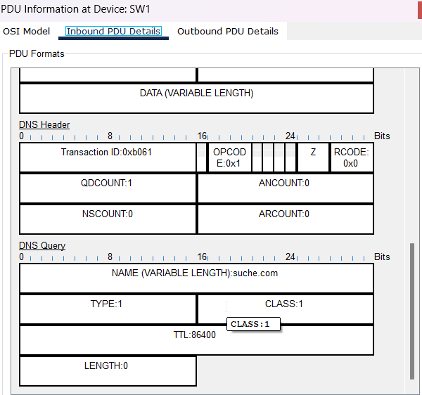
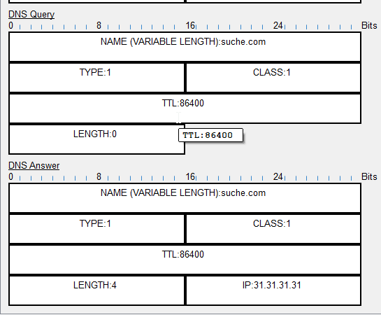
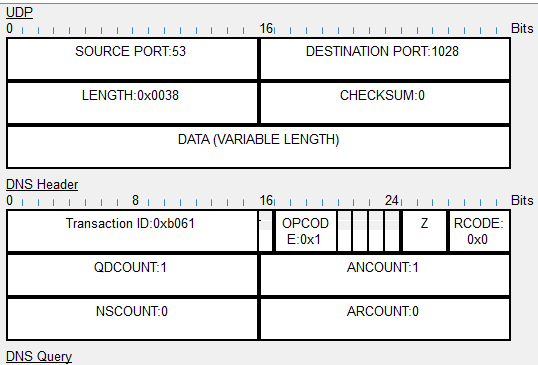

Wo befindet sich die Zonendatei (Datei mit DNS-Einträgen) für die Domain "tbz.ch", die vom Domaininhaber verwaltet wird?
Die zonenDatei befindet sich auf dem DNS Server indem 
Server:  stbzdc23.tbz.local
Address:  10.62.98.9
Was ist der Unterschied zwischen einem DNS forwarder und einem DNS resolver?
Der DNS Forwarder leitet deine Anfragen an den Resolver(, der resolver holt sich die Nötigen Informationen zuerst beim Root und danach beim Top Level Domain Server. Der Forwarder Speichert danach den Eintrag im Cache.
Ist der DNS Service eines typischen Home-Routers (z.B. Swisscom Internet Box) ein DNS forwarder oder DNS resolver?
Ein DNS Forwarder
Welcher Teil der FQDN (TLD, Second-Level, Third-Level, usw. ) wird bei einem Domain Name Registrar definiert und welche Teile können durch den Besitzer frei definiert werden?
Der Second-Level Domain kann frei Bestimmt werden. Für Die ToplevelDomain muss man bestimmte Voraussetzungen erfüllen.

Aufgabe
Die nachfolgenden Abschnitte sind Schritt-für-Schritt durchzugehen. Halten Sie alle Antworten und getätigten Konfigurationen in ihrem persönlichen Lernjournal fest (Siehe Vorlagen).

Ausgangslage

Im nachfolgenden Netzwerk sind allen Geräte per DHCP eine IPv4 Adresse zugewiesen worden. Der Router R1 agiert als DHCP Server und verteilt IP Adressen.
*Tipp: Starten Sie alle Geräte nach dem Öffnen des Labors neu. Drücken Sie dazu unten Links im Packet Tracer auf das nachfolgende Symbol:

Anschliessend empfiehlt es sich 1 Minute zu warten, bevor mit den Aufgaben fortgefahren wird, damit alle Geräte Zeit haben per DHCP eine IPv4-Adresse zu beziehen.

DNS Query durchführen
Auf dem DNS Server sind zwei DNS Einträge konfiguriert. Ziel ist es im Simulation-Modus des Cisco Packet Tracer den DNS Query zu verfolgen und zu analysieren.

Cisco Packet Tracer in den Simulation-Modus versetzen (Button unten rechts).
PC0 Command Prompt öffnen. Befehl nslookup suche.com eingeben.
Auf der logischen Topologie erscheint ein PDU neben PDU.
Doppelklick auf PDU zeigt Details an. (Achtung! Sicherstellen, dass es sich um das DNS query handelt!)
Fragen zum

Todo:

Screenshot vom DNS Query mit den Details in Laborbericht einfügen.

Fragen zum PDU DNS Query beantworten:

Wie weiss der PC0, dass er den DNS Query an 1.1.1.1 bzw. DNS-Server schicken muss?

Seine Konfiguration zeigt auf den 1.1.1.1 für DNS Anfragen.

Welches Layer 4 Protokoll kommt bei DHCP zum Einsatz?

Mit dem TCP Protokoll arbeiter der DHCP

Was für einen QDCOUNT Wert hat es und in welchem Teil ist diese Feld?
Er hat den Wert 1 und ist in DNS Header drinnen.
Wie lautet die Transaction ID?
Die Transaction ID lautet 0xb061 . 
Was für einen TYPE und CLASS hat der Query?
Die Query hat den Type 1 und Class 1

PDU-Fenster schliessen. PDU Weg zum Server beobachten:
Solange auf Next-Klicken bis das PDU den DNS-Server erreicht.
Der Server generiert eine Antwort. Nun dieses PDU öffnen und folgende Fragen beantworten.

Fragen zum PDU DNS Query response beantworten:

Was für eine IP Adresse steht in der DNS query response bzw. DNS Answer? ==> Mit Screenshot belegen.
Es steht die IP 31.31.31.31 also die des Webserver

Inwiefern unterscheidet sich die DNS query response zur DNS query? In welchem/n Feld(ern) sind der "DNS-Packet-Typ" festgehalten?
Die Felder IP und lenght unterscheiden sich  der Ancount Feld ist auf 1 geändert.
