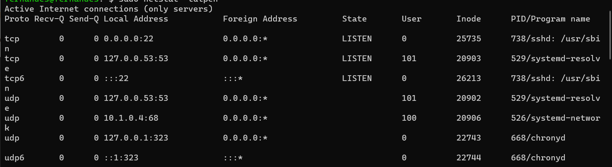
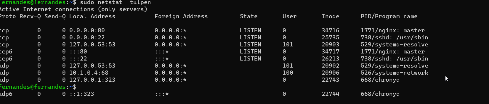
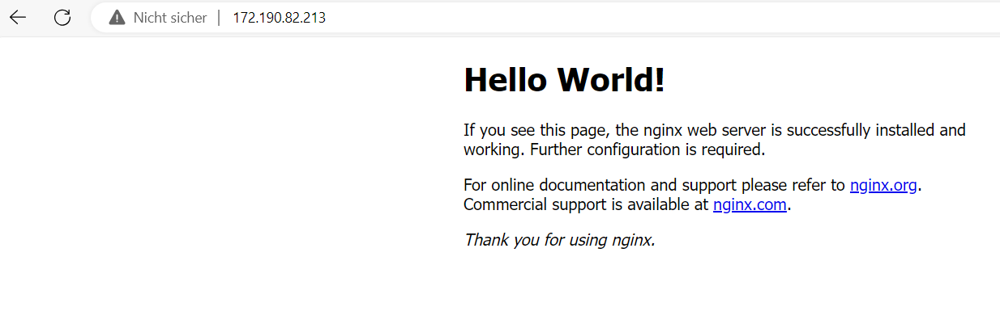
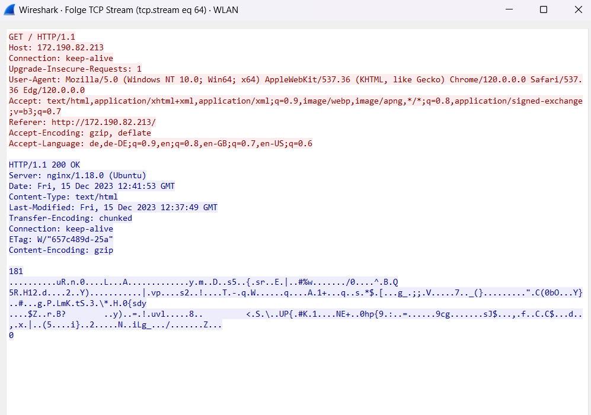
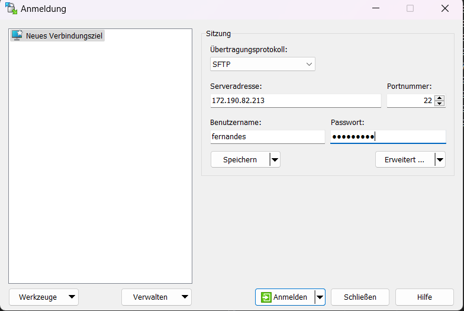
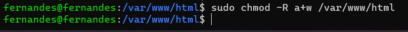
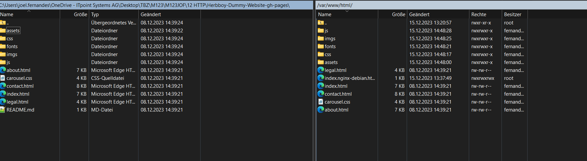

In Windows, macOS und die meisten Linux Distributionen ist SSH Client Programm integriert. Öffne die Konsole (Unter Windows cmd.exe). Verwende den nachfolgenden Befehl, um dich mit deiner VM zu verbinden. Ersetze IP durch die IP-Adresse des Servers und user durch den entsprechenden Usernamen. Die Angaben solltest du von der Lehrperson erhalten haben.

ssh user@IP

Nachfolgend wirst du aufgefordert das Passwort einzugeben.
Während der Eingabe siehst du auf dem Terminal kein echo (In einem Terminal bedeutet "Echo", dass die Eingaben des Benutzers (wie Tastenanschläge) auf dem Bildschirm sichtbar wiedergegeben werden.)
Wenn die SSH Verbindung erfolgreich aufgebaut ist, siehst du die Befehlzeile des Servers

azureuser@mmuster:~$

Wenn du via SSH auf einem anderen System eingeloggt bist, bedeutet das, dass eine Verbindung über das Internet oder lokale Netzwerk eine verschlüsselte Verbindung zu einem anderen Computer hergestellt wurde. Es wäre, als sässen sie direkt vor dem Comptuer, allerdings ohne die gewohnte grafische Oberfläche wie Ihren Desktop, sondern über das CLI (Command Line Interface).

Netstat installieren mit Command:

sudo apt install net-tools

scp "C:\Users\joel.fernandes\OneDrive - ITpoint Systems AG\Desktop\TBZ\M123\M123JOF\12 HTTP\Herbboy-Dummy-Website-gh-pages" fernandes@172.190.82.213:/var/www/html

webserver Files Uploaden:

1.Windows CSP installieren.

Mit CSP auf den Server verbinden mit den Credentials

Es werden die richtigen Berechtigungen benötigt.

Danach kann man die Files auf den richtigen Pfad rübertransferieren.
