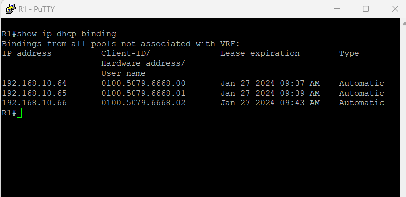
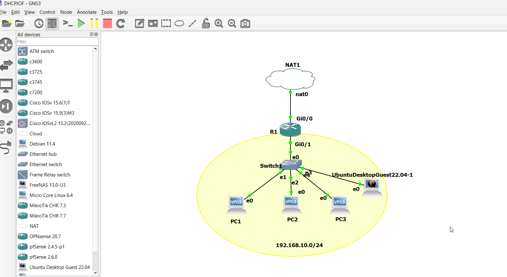
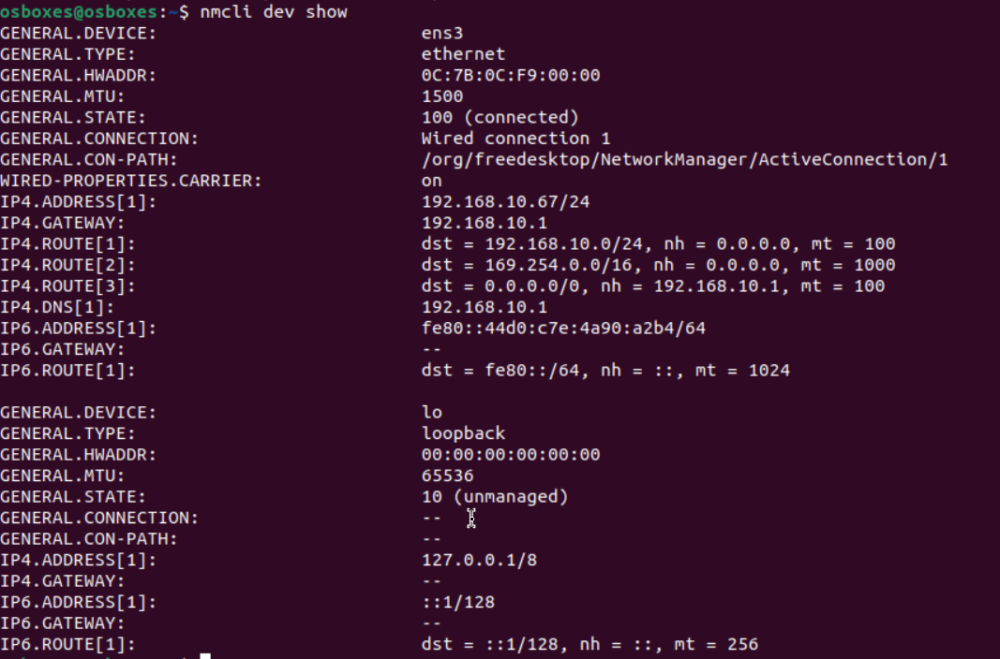

Der Router gibt eine Tabelle aus. Beantworten Sie die nachfolgenden Fragen:

Welche IP-Adresse ist auf dem Interface GigabitEthernet0/0 und GigabitEthernet0/1 konfiguriert?
- auf GE 0/0 ist die IP 192.168.122.90  konfiguriert Ge 0/1 ist  192.168.10.1  konfiguriert

Ist das Interface GigabitEthernet0/2 aktiv? Welchen Status hat es?

- Der Status ist up also aktiv

Wo ist das Interface GigabitEthernet0/1 in der Netzwerkgrafik zu finden?

- Das interface ist zwischen dem Router und Switch zu finden.

Befehle:
show ip interface brief

Mit welchem Befehl (wie lautet die Zeile) wurde der Name des Routers konfiguriert?

- hostname R1

Wie lautet das Passwort für den remote access mit TELNET?

- das passwort lautet cisco

Welche IP-Adresse wird dem ersten DHCP-Client vergeben, der einen DHCP request macht?

network: 192.168.10.0 255.255.255.0

ip address pool: 192.168.10.64 - 192.168.10.254 

default gateway: 192.168.10.1

dns nameserver:192.168.10.1

interface: GigabitEthernet0/1

Welche IP-Adresse wird dem ersten DHCP-Client vergeben, der einen DHCP request macht?

- Er vergibt die erste Ip Adresse des Adress Pools also in diesem Fal 192.168.1.64 da die 192.168.1.1- 192.168.1.63 excluded sind.

Welche IP Adresse wir dem Client zugeteilt?

- 192.168.10.64

Nach welcher Zeit müssen die Clients den DHCP lease erneuern?

- nach 24 Stunden

Welche Option Nummer hat die Option "Router"?

- Die Nummer 3

Welche Option Nummer hat die Option "Domain Name Server"?

- hat die nummer 6

Öffnen Sie die Konsole des PC1, probieren Sie nachfolgende Befehle aus. Beschreiben Sie für jeden Befehl dessen Funktion und den Inhalt des Outputs. Pro Befehl maximal 1 bis 3 Sätze. Bei den drei Ping Befehlen ist der unterschied zu erklären.

show ip

- dieser Befehl zeigt die Netzwerkeinstellungen welches das gerät besitzt. Eigene IP, Subnetzmaske, Standartgateway, DHCP Server, DNS Server und Mac Addresse

dhcp

- Dieser Befehl macht einen Neuen DHCP Request und gibt an welche IP das Gerät erhalten hat und zeigt die Ip des DHCP Server an.

ping 192.168.10.1

-Dieser Befehl sender Datenpackete an die gegebene IP und gibt an, ob die Packete zurückgesendet werden, also ob das Gerät antwortet.
Dieser Ping ist in denselben Subnetz 

ping google.ch

- Dieser ping muss noch auf die IP aufgelöst werden also benötigt der Client einen localhostfile oder DNS Server dafür.

ping 8.8.8.8

- Hier pingt er auch ausserhalb des LAN und versucht den DNS Server von Google anzupingen.

Ziel: Alle PCs (PC1,PC2,PC3) fordern automatisch beim Boot per DHCP eine IP-Adresse an.

man get über die Konsole:
tippt dhcp

Das gerät erhält eine IP

command: save 
das saved das Startupconfig 

und danach wird beim Aufstarten immer den DHCP request gemacht.

Ziel: Screenshot mit dem Output des Cisco CLI Befehls, der alle an DHCP Clients verteilte IP Adressen anzeigt. Auf dem Screenshot ist der Befehl und die drei leases der PCs sichtbar.

Befehl:

- show ip dhcp binding

Ziel: Erweiterung des GNS3 Projekt Netzwerkes um eine Ubuntu Desktop Guest VM. Zugriff mit der Ubuntu Desktop Guest VM mit Firefox auf das Internet.

